Question 2 Semantic Segmentation Using Unet->
All Codes made with help of Chat gpt by feeding question subpart as prompt

2.1 -> Vanilla Unet for sematic segmentation

Results->

Training->
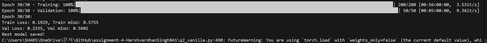

Metrics plot->
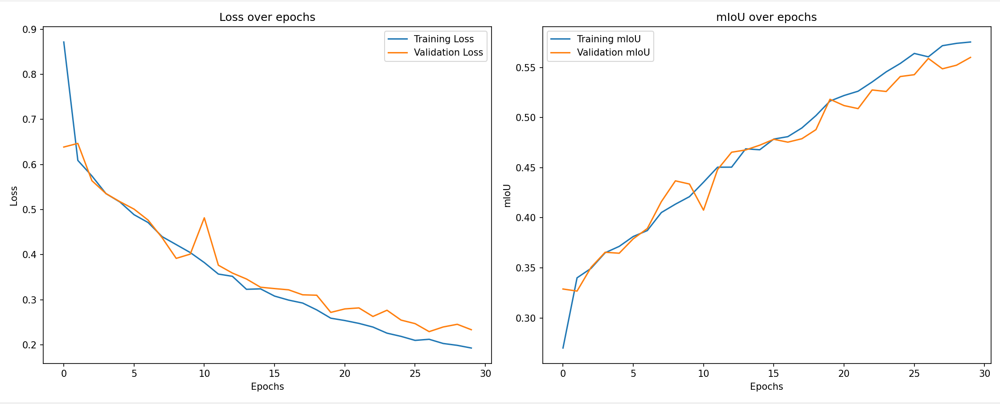

Prediction Visualisations->

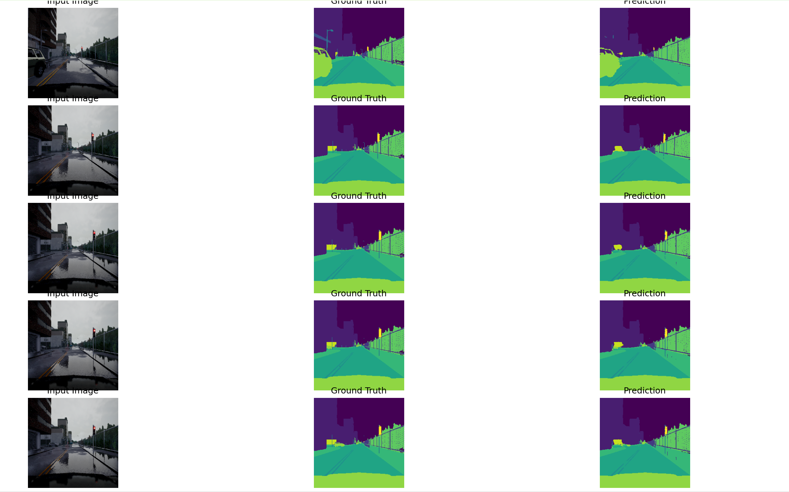

Test->
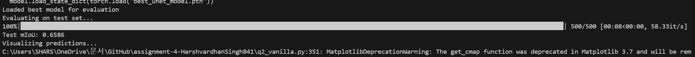

test mIoU= 0.6586

2.2-> Unet without skip connections->

results->

Training->

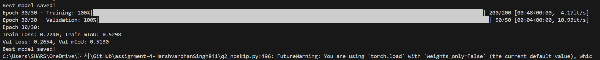

Metrics->

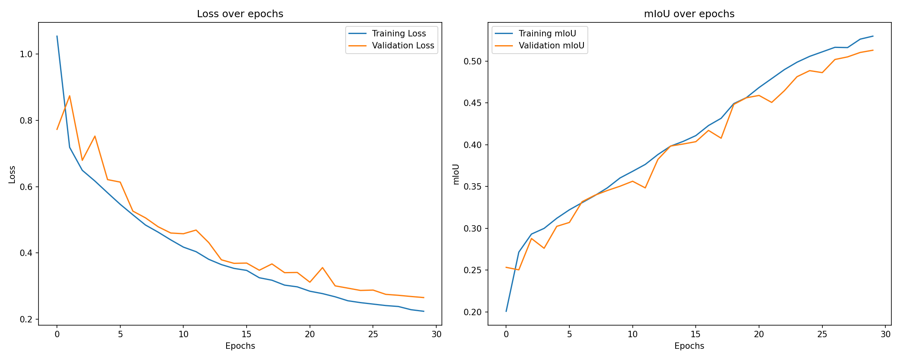

Visusalisation->

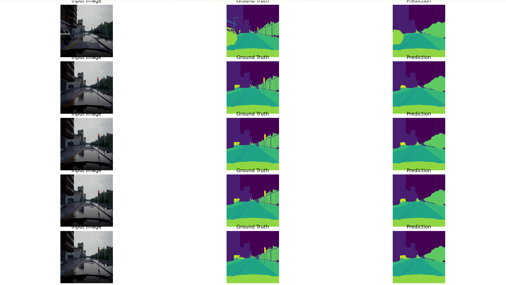

Test->

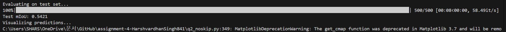
Test mIoU=0.5421

2.2.2-> Visualisation difference between skip and no skip net

From the visualisation of the predicted segmentation , I see lesser fine grained details inside the noskip net results, (like the sharper boundaries are missing more)

With skip connections: Predictions align better with fine grained boundaries and small objects

Without Skip connections:The output appears more blurry and Coarse, failing to preserve clear boundaries (road/side walk)

The spatial structure of objects like poles street lights is less captured in noskip net

2.2.3-> Role of skip connections 

They bridge together the encoder and decoder sides directly allowing high resolution fine-grained information to flow and affect the output , giving more information about smaller and fine grained details of the segmented classes of objects, 

This helps with recapturing the retina spatial detail that was lost in the downsampling during encoding process

Without skip connections the decoder has to solely rely on low resolution abstract representation making it harder to get the relation between finer grained boundaries

Also improves gradient flow.

2.3-> Residual U-Net

Results->

Training->
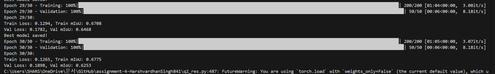

Metrics->

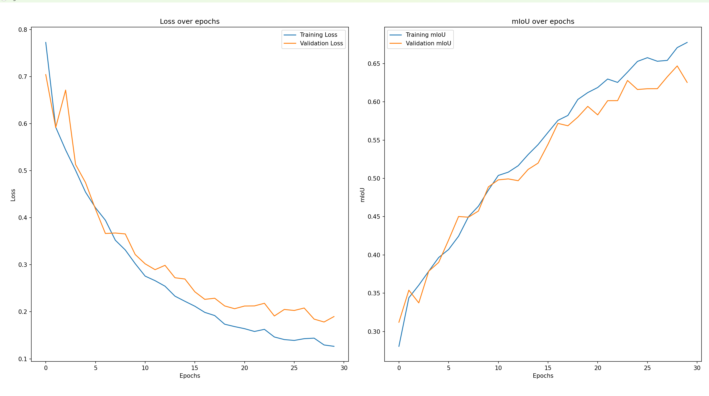

Visualisation->

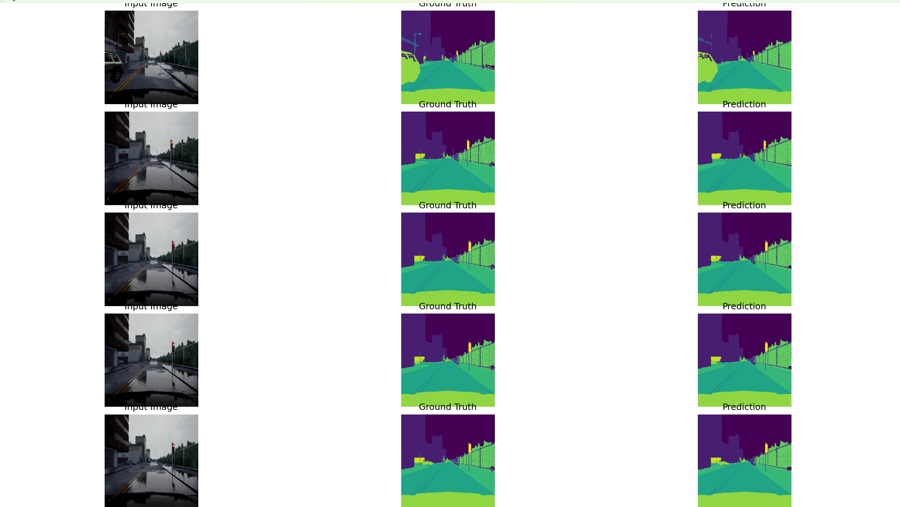

Test->
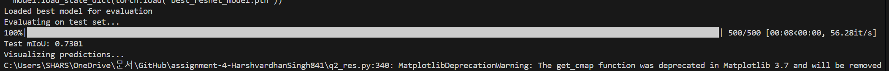

Test mIoU= 0.7301

huge increase (nearly .9 mIoU over Vanilla Unet) in mIoU 

2.4-> Gated attention U-Net

Results->

Training->
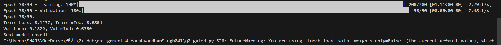

Metrics->

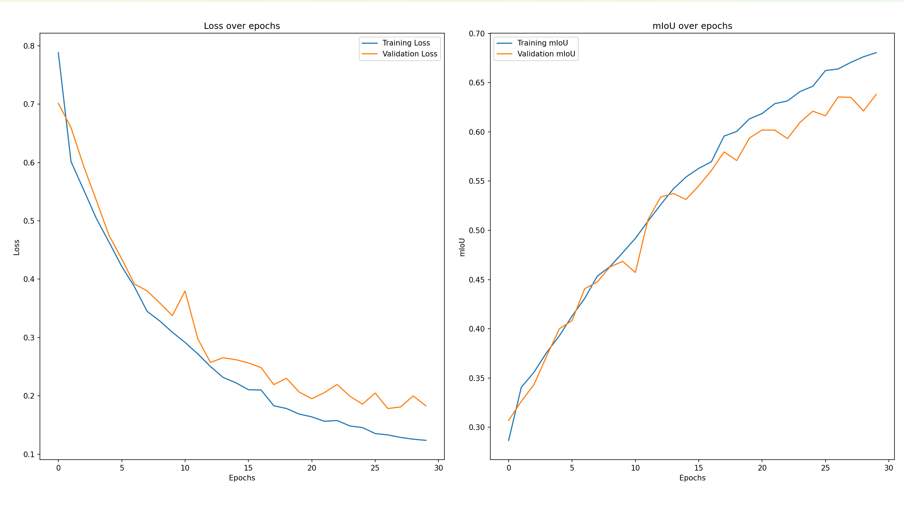

Visualisation->

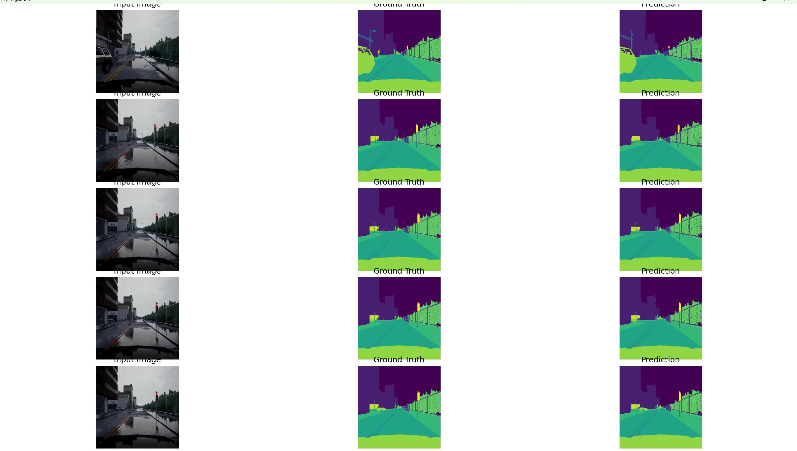

Test->

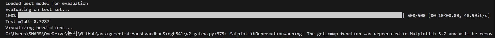

Test mIoU = 0.7287

3.4.2 

Discussion of Gated attention and its uses in the paper->

Attention gates provide these following features:

Automatic focus on relevant features: by suppressing irrelevant features in input image allows the network to focus on the target structures.

Improves model's sensitivity to target structures

Good parameter efficiency : adds only little parameters so we get performance gains for little computation overhead

Tries to eliminate the need for additional post processing by aiming to improve predictions in the network itself

3.4.3 performance comparision 

In my case , addition of Gated attention over the normal residual U-net caused a slight drop in performance and here are the plausible reasons that I think why it happened ->

Very small dataset , Only 2000 images -labels for training causes bias and underdeveloped Gate causing it to fail to efficiently learn the relevant target structures resulting in a drop in performance 

Already pretty strong of a baseline that residual net gave so it mightve been hard to get performance gains over such a limited image space

Training dynamics , my lr = 0.01 mightve hurt the model since Attention gates require very precise tuning , meaning my Suboptimal hyper parameterisation mightve hurt the model resulting in poorer performance

Data complexity might be lacking in the image space provided in the dataset resulting in poor target localisation for the AG causing drop in performance

with this I conclude my assignment 4

